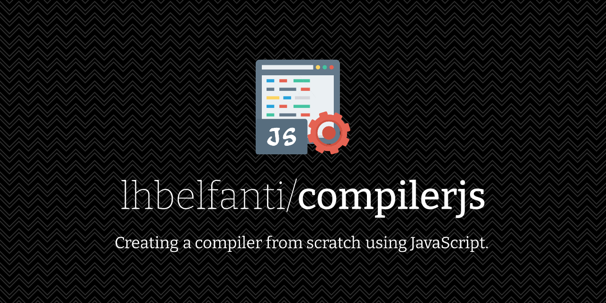

  <picture>
    <source media="(prefers-color-scheme: dark)" srcset="media/compilerjs-dark.png">
    <source media="(prefers-color-scheme: light)" srcset="media/compilerjs-light.png">
    
  </picture>

   

  
  

# Compiler phases

## Evaluator

In it we simply visit each node from the tree with pre-order traversal and either: 

-   Return the corresponding value, in case the node is of type number. 
-   Perform the corresponding arithmetic operation, in case of an operation node. 

### evaluate

Evaluate the expression and return the result.

**Parameters**

-   `ast` **[Object](https://developer.mozilla.org/en-US/docs/Web/JavaScript/Reference/Global_Objects/Object)** The AST.

Returns **[String](https://developer.mozilla.org/en-US/docs/Web/JavaScript/Reference/Global_Objects/String)** The result.

### doOperation

Resolve the operation and returns the result.

**Parameters**

-   `ast` **[Object](https://developer.mozilla.org/en-US/docs/Web/JavaScript/Reference/Global_Objects/Object)** The AST.

## Lexer

The lexer is responsible for turning the input string into a list of tokens. 
 
For instance, the lexer will turn the following expression:

<pre>
sum 5 sub 2 mul 3 1 sum 4
</pre>

To the following array:

<pre>
["sum", "5", "sub", "2", "mul", "3", "1", "sum", "4"]
</pre>

### lex

Generate all the tokens of the grammar. 
The grammar string is splitted by a single space. Then the produced 
substrings are mapped to their trimmed version and the empty
strings are filtered.

**Parameters**

-   `grammar` **[String](https://developer.mozilla.org/en-US/docs/Web/JavaScript/Reference/Global_Objects/String)** The grammar to be processed.

Returns **[Array](https://developer.mozilla.org/en-US/docs/Web/JavaScript/Reference/Global_Objects/Array)** an array of tokens.

## Parser

The parser is responsible for turing the list of tokens
into an AST or Abstract Syntax Tree. 
Usually, the parser is implemented base on a grammar. 
Here’s the grammar of our language: 

<pre>
digit = 0 | 1 | 2 | 3 | 4 | 5 | 6 | 7 | 8 | 9
num = digit+
op = sum | sub | mul | div
expr = num | op expr+
</pre>

 Visually, the parsing is a process which turns the array: 

<pre>
const tokens = ["sub", "2", "sum", "1", "3", "4"];
</pre>

to the following tree:

<pre>
   sub
   / \
  2  sum
     /|\
    1 3 4
</pre>

### parse

Define a variable to reference the node being processed
and call parseExpr.

**Parameters**

-   `tokens` **[String](https://developer.mozilla.org/en-US/docs/Web/JavaScript/Reference/Global_Objects/String)** The array of tokens given by the lexer.

Returns **[Object](https://developer.mozilla.org/en-US/docs/Web/JavaScript/Reference/Global_Objects/Object)** An AST.

### peek

Returns the element of tokens associated with the current 
value of the c local variable.

Returns **[String](https://developer.mozilla.org/en-US/docs/Web/JavaScript/Reference/Global_Objects/String)** 

### consume

Returns the element of tokens associated with the current 
value of the c local variable and increments c.

Returns **[String](https://developer.mozilla.org/en-US/docs/Web/JavaScript/Reference/Global_Objects/String)** 

### parseNum

Gets the current token (i.e. invokes peek()), parses it to a 
natural number and returns a new number token.

Returns **[Object](https://developer.mozilla.org/en-US/docs/Web/JavaScript/Reference/Global_Objects/Object)** A number node.

### parseOp

Since parseOp has been invoked by parseExpr when the value of peek() 
is not a number we know that it is an operator so we create a new operation node.
In the node declaration we set the list of “sub-expressions” to 
be the empty list (i.e. \[]), the operation name to the value of peek() 
and the type of the node to Op. Later, while we don’t reach the end of 
the program, we loop over all tokens by pushing the currently parsed expression 
to the list of “sub-expressions\` of the given node. Finally, we return the node.

Returns **[Object](https://developer.mozilla.org/en-US/docs/Web/JavaScript/Reference/Global_Objects/Object)** An operation node.

### parseExpr

Checks if the current token matches the regular expression /\\d/ 
(i.e. is a number) and invokes parseNum if the match was successful, 
otherwise returns parseOp.

Returns **[String](https://developer.mozilla.org/en-US/docs/Web/JavaScript/Reference/Global_Objects/String)** 

## Transpiler

Instead of interpreting the AST, we can translate it to 
another language. Here's how we can do that with JavaScript.

### transpileNum

Get the number node transpiled.

**Parameters**

-   `ast` **[Object](https://developer.mozilla.org/en-US/docs/Web/JavaScript/Reference/Global_Objects/Object)** The AST.

Returns **[String](https://developer.mozilla.org/en-US/docs/Web/JavaScript/Reference/Global_Objects/String)** Number node transpiled.

### transpileOp

Get the operation node transpiled.

**Parameters**

-   `ast` **[Object](https://developer.mozilla.org/en-US/docs/Web/JavaScript/Reference/Global_Objects/Object)** The AST.

Returns **[String](https://developer.mozilla.org/en-US/docs/Web/JavaScript/Reference/Global_Objects/String)** Operation node transpiled.

### transpileNode

Get the node transpiled.

**Parameters**

-   `ast` **[Object](https://developer.mozilla.org/en-US/docs/Web/JavaScript/Reference/Global_Objects/Object)** The AST.

Returns **[String](https://developer.mozilla.org/en-US/docs/Web/JavaScript/Reference/Global_Objects/String)** Node transpiled.

### transpile

Transpile the AST to JavaScript code.

**Parameters**

-   `ast` **[Object](https://developer.mozilla.org/en-US/docs/Web/JavaScript/Reference/Global_Objects/Object)** The AST.

Returns **[String](https://developer.mozilla.org/en-US/docs/Web/JavaScript/Reference/Global_Objects/String)** JavaScript code.

---
## License

[MIT](https://choosealicense.com/licenses/mit/)